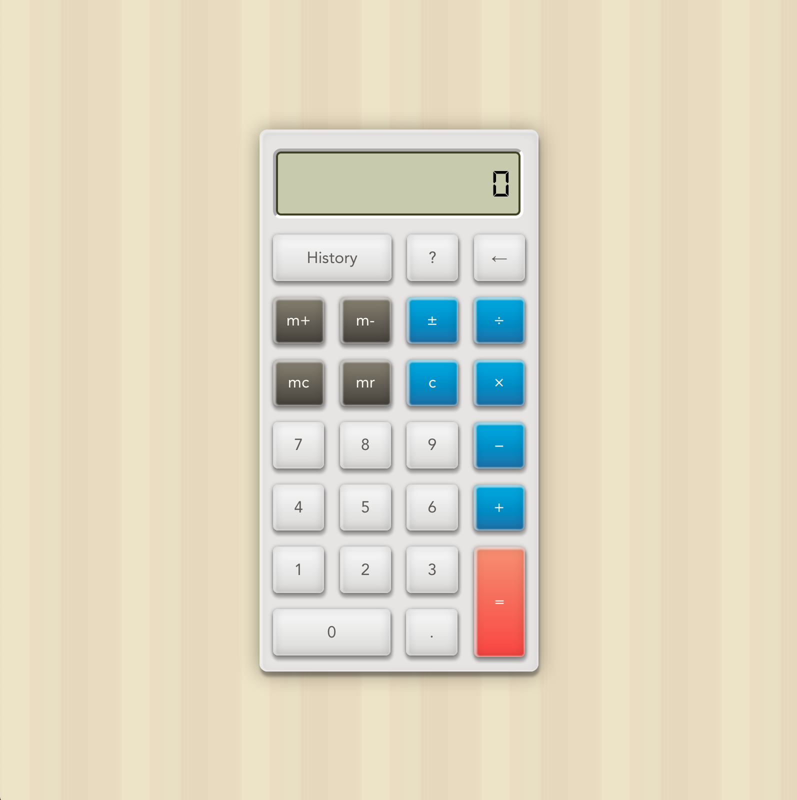

# calculator

> A calculator project

Here's a calculator app built with Vue.js, with Jest unit tests and Nightwatch e2e tests.
This is an interactive calculator that can be used with button clicking as well as the keyboard. The ? button shows you the shortcuts for each button. Number buttons map directly with their keyboard values. This is screen reader friendly as well.



The article about this app can be found here:

https://suefeng.com/portfolio/calculator/

The app can be found here:

https://suefeng.com/demos/play/calculator/dist/#/

## Build Setup

``` bash
# install dependencies
npm install

# serve with hot reload at localhost:8080
npm run dev

# build for production with minification
npm run build

# build for production and view the bundle analyzer report
npm run build --report

# run unit tests
npm run unit

# run e2e tests
npm run e2e

# run all tests
npm test
```

For a detailed explanation on how things work, check out the [guide](http://vuejs-templates.github.io/webpack/) and [docs for vue-loader](http://vuejs.github.io/vue-loader).
